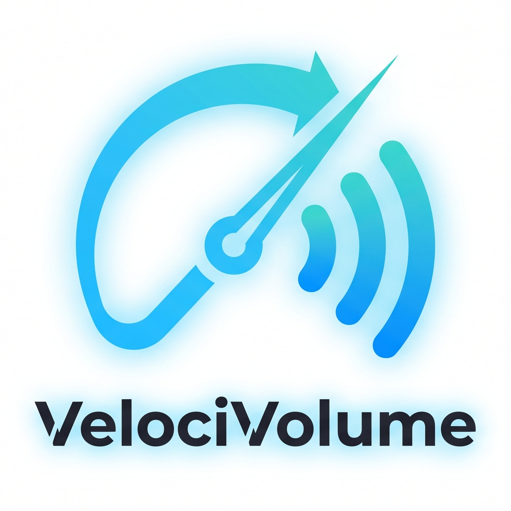

<p align="center">
  
</p>

<h1 align="center">VelociVolume</h1>

<p align="center">
  <strong>Adaptive Speed-Based Volume Control for Android</strong>
</p>

<p align="center">
  
  
  
  
  
</p>

---

## ✨ Features

- 🏎️ **Dynamic Speed-Compensated Volume**: Automatically scales system media volume (`STREAM_MUSIC`) linearly between your configured minimum and maximum speed thresholds.
- 🔄 **Continuous Background Foreground Service**: Stays active and reliable while running in the background, even when your screen is locked or while running navigation apps like Google Maps or Waze and music players like Spotify or YouTube Music.
- ⚡ **Android Quick Settings Tile**: Easily toggle speed-volume monitoring ON or OFF directly from your device's Quick Settings notification shade pull-down without needing to open the app.
- 📐 **Customizable Speed Curves & Thresholds**:
  - Set your custom **Min Speed** (speed below which volume stays at minimum).
  - Set your custom **Max Speed** (speed at which volume reaches maximum).
  - Toggle between **km/h** (0–200 km/h) and **mph** (0–120 mph) with instant unit conversion.
- 🎚️ **Customizable Volume Limits**:
  - Define your **Min Volume %** and **Max Volume %** to prevent music from becoming too quiet at a stop or deafening at highway speeds.
- 🌊 **GPS Speed Smoothing (Exponential Moving Average)**:
  - Built-in low-pass smoothing filter ($\alpha = 0.35$) eliminates volume fluttering caused by momentary GPS signal jitter or stop-and-go city traffic.
- ⏸️ **Smart Auto-Pause & Resume**:
  - Optional toggle to automatically pause media playback when you come to a complete stop (< 1.0 km/h) and resume playback once you start moving again (≥ 2.5 km/h)—ideal for red lights, toll booths, or drive-thrus.
- 📊 **Real-Time Live Dashboard**:
  - Clean speedometer and live volume gauge indicating current calculated speed, percentage, and exact Android system stream volume level.
- 🔋 **Battery Efficient & Safe**:
  - Efficient GPS polling via Google Play Services Fused Location Client.
  - Safe 4-hour safety timeout on background wake locks to prevent unintended battery drain.
  - One-tap "Stop" action directly within the persistent notification.
- 🛡️ **100% Private & Offline**:
  - No accounts, no ads, no trackers, and zero network calls. Location data is processed strictly on-device in real time and is never saved or transmitted.

---

## 📱 How It Works

VelociVolume continuously reads your current GPS ground speed and maps it to your chosen volume range:

1. **Speed Clamping & Normalization**:
   $$\text{Ratio} = \frac{\text{ClampedSpeed} - \text{MinSpeed}}{\text{MaxSpeed} - \text{MinSpeed}}$$
   - When $\text{Speed} \le \text{MinSpeed}$, Volume is set to **Min Volume**.
   - When $\text{Speed} \ge \text{MaxSpeed}$, Volume is capped at **Max Volume**.
   - Between thresholds, volume scales proportionally.
2. **Smoothing Filter**:
   $$\text{Speed}_{\text{smoothed}} = \alpha \cdot \text{Speed}_{\text{raw}} + (1 - \alpha) \cdot \text{Speed}_{\text{previous}}$$
3. **Volume Output**: The calculated percentage is converted to the device's native stream volume steps (`audioManager.setStreamVolume`) without creating audio artifacts.

---

## 📋 Requirements & Permissions

### System Requirements
- **OS**: Android 7.0 (API Level 24) or higher (Target SDK: Android 14 / API 34).
- **Hardware**: GPS / Location sensor.

### Permissions
| Permission | Purpose |
| :--- | :--- |
| `ACCESS_FINE_LOCATION` | Required to query GPS ground speed in real time. |
| `FOREGROUND_SERVICE` & `FOREGROUND_SERVICE_LOCATION` | Allows speed tracking to continue uninterrupted while the app is in the background on Android 10+. |
| `POST_NOTIFICATIONS` | Required on Android 13+ to display the ongoing notification with live status and quick stop button. |
| `WAKE_LOCK` | Keeps the CPU active to prevent the OS from pausing location updates when the screen is turned off. |

---

## 🛠️ Building & Installation

### Prerequisites
- [Android Studio Ladybug / Iguana](https://developer.android.com/studio) or newer
- JDK 17 or higher
- Android SDK 34

### Build from Source

1. **Clone the repository**:
   ```bash
   git clone https://github.com/redystum/VelociVolume.git
   cd VelociVolume
   ```

2. **Build Debug APK with Gradle**:
   ```bash
   ./gradlew assembleDebug
   ```
   The APK will be generated at:
   ```
   app/build/outputs/apk/debug/app-debug.apk
   ```

3. **Install on connected device via ADB**:
   ```bash
   adb install -r app/build/outputs/apk/debug/app-debug.apk
   ```

---

## 🚀 Quick Start Guide

1. **Open VelociVolume** and grant the required **Location** and **Notification** permissions when prompted.
2. **Choose your speed unit** (km/h or mph).
3. **Configure your volume curve**:
   - Set **Min Speed** (e.g., `20 km/h` / `15 mph` for city cruising or idle stops).
   - Set **Max Speed** (e.g., `90 km/h` / `60 mph` for highway cruising).
   - Set your comfortable **Min Volume** and **Max Volume** percentages.
4. **Enable Smart Options**:
   - Keep **GPS Speed Smoothing** enabled for stable volume transitions.
   - Optionally toggle **Auto-pause when stopped** to mute/pause audio at red lights.
5. **Turn On Monitoring**: Flip the **Master Switch** on the dashboard.
6. *(Optional)* Add the **VelociVolume Quick Settings Tile** to your Android notification shade for fast 1-tap toggling.

---

## 📄 License

This project is licensed under the [MIT License](LICENSE) (or applicable repository license). Feel free to contribute, open issues, or submit pull requests!
